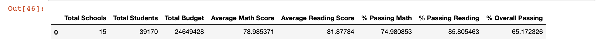
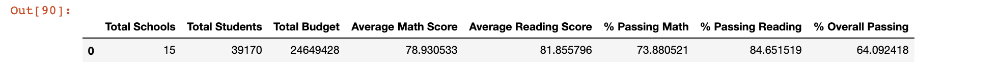

# School District Analysis

###### Written by: David Adams
###### Written on: January 22, 2021
###### Written with: Python, Pandas, Jupyter Notebook
###### Written for: Columbia University Module 4

### Overview of the School District Analysis project
- [X] Deliverable 1: Replace ninth-grade reading and math scores for Thomas High School
- [X] Deliverable 2: Repeat the school district analysis
- [X] Compare the PyCitySchools Module to the PyCitySchools Challenge Code

The purpose of this project was to frame and group student data from specific schools based on multiple categorizes such as school type, school size, school budgets in a certain district. By framing this data, it is easier to list out and understand the student scores for reading and math within those certain categories.

The data in jupyter notebook pieces together the data of this school district.
 
### Process of Analysis
1. Followed the instructions and coded through the module.
2. Followed instructions on the Challenge Starter document.
3. Compared the outputs.

### Results from updating the School District Analysis to match Deliverable 1

In the first PyCitySchools python file, the ninth-grade reading and math scores for Thomas High School have not been changed. The data in that file remains as it was inputted. For the data in the PyCitySchool Challenge file, the ninth-grade reading and math scores for Thomas High School have been changed to 'NaN'. 

#### How is the district summary affected?

*The code:*
```
# Create a District Summary DataFrame
district_summary_df = pd.DataFrame(
          [{"Total Schools": school_count, 
          "Total Students": student_count, 
          "Total Budget": total_budget,
          "Average Math Score": average_math_score, 
          "Average Reading Score": average_reading_score,
          "% Passing Math": passing_math_percentage,
         "% Passing Reading": passing_reading_percentage,
        "% Overall Passing": overall_passing_percentage}])
```   
*Output PyCityModules:*



*Output PyCityChallenge:*


       
The overall percentage of passing students decreased in the PyCityChallenge file. Thomas High School ninth-graders didn't score as well as the rest of the district in reading or math. I only compared the test scores because it was the only aspect of the data changed from the PyCity Modules and the Challenge.

#### How is the school summary affected?

Using the loc function,

```per_school_summary_df.loc["Thomas High School",:]```

I found the tables that listed out all of the data for Thomas High School in both files. See Table 1. The count of students is the same because their math and reading scores were the only data changed. There wasn't a real change in their 

Table 1:

Title | PyCitySchools | PyCityChallenge
----- | ------------- | ---------------
School Type | Charter | Charter
Total Students | 1635 | 1635
Total School Budget | $1,043,130.00 | $1,043,130.00
Per Student Budget | $638.00 | $638.00
Average Math Score | 83.4183 | 83.3509
Average Reading Score | 83.8489 | 83.8961
% Passing Math | 93.2722 | 66.9113
% Passing Reading | 97.3089 | 69.6636
% Overall Passing | 90.9480 | 65.0765

The % of passing students changed significantly when I removed the scores for the ninth-graders at Thomas High School. There is a steep decrease in passing scores for Thomas High School when the ninth-grade data is removed. This shows that students at Thomas High School in ninth grade are passing their classes more than the older grades.

#### How does replacing the ninth graders math and reading scores affect Thomas High School performance relative to the other schools?

The scores are still similar. They only slightly changed. The more significant changes came from the percentage of students passing in their respective grade levels.

#### How does replacing the ninth-grade scores affect the following:

* Math and reading scores by grade:
      All the High Schools have lower grades in the 9th Grade column. This happened because the data from Thomas High School was changed to NaN. It was one of the strategies we learned when dealing with missing data. In this case, I intentionally took out the data to analyze the changes in the School District data.
      
* Scores by school spending:
     It affects the per student to % passed calculations. The students that had their data changed in the ninth-grade section affected the overall percentage pass rate compared to the school spending data from the PyCitySchools a little. 
     
* Scores by school size  
    It affects the % of passing students throughout the dataset. The data suggests that the data changed the passing rates but not the overall scores. The data from the PyCitySchools compared to the PyCityChallenge scores to school size was minscule but still present.

* Scores by school type
    It affects the % of passing students throughout the dataset. The data suggests that the data changed the passing rates but not the overall scores. 


    
